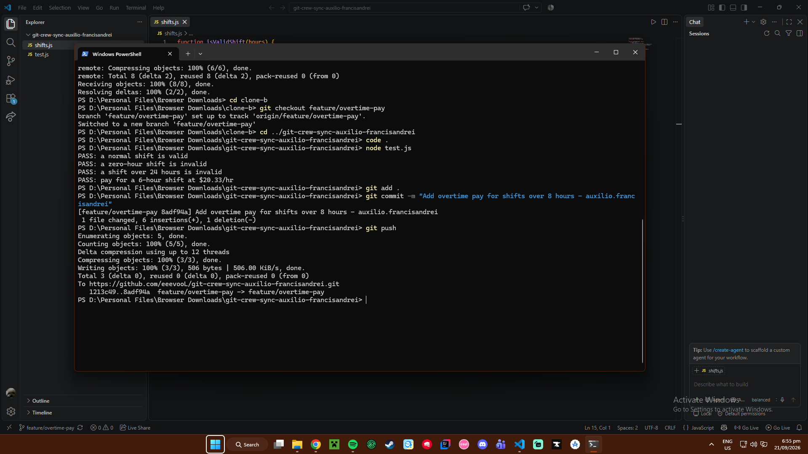
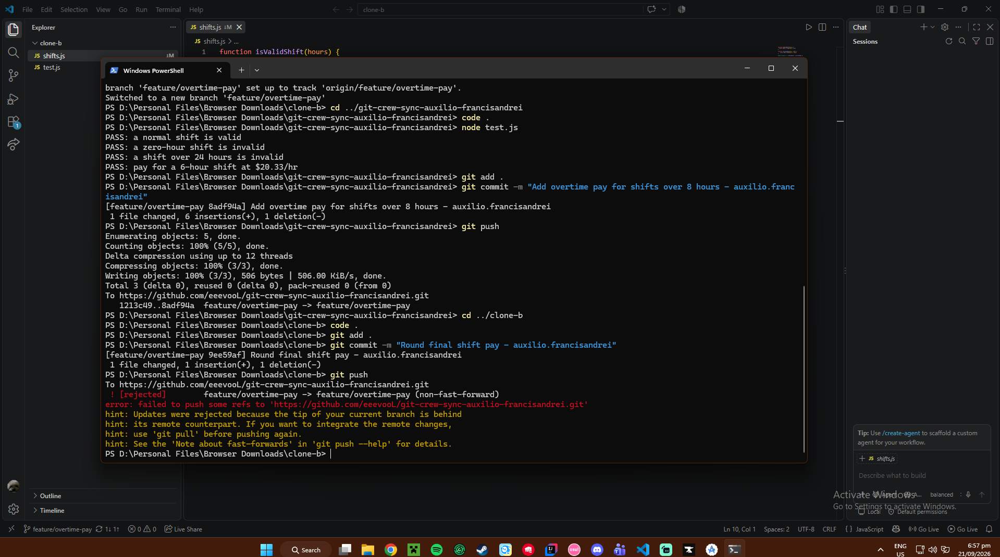
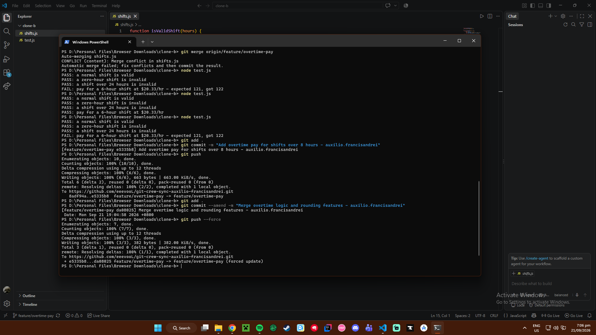
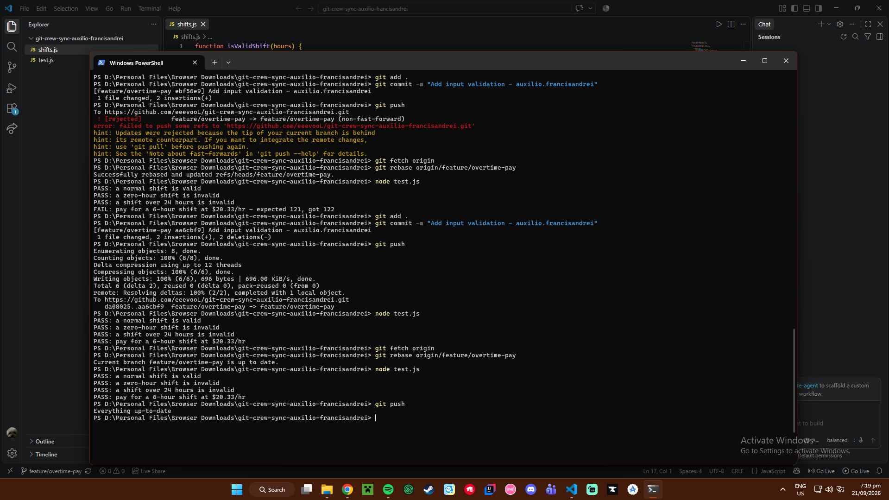
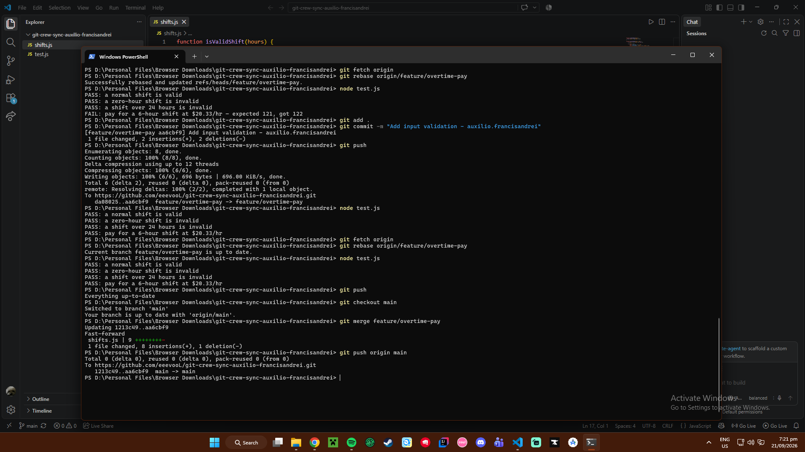
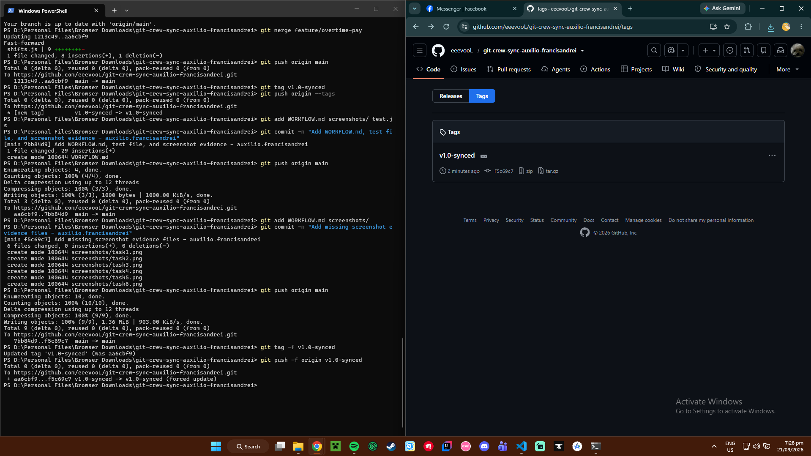

# Git Workflow Lab

## Screenshots
### Task 1

### Task 2

### Task 3

### Task 4

### Task 5

### Task 6

## Questions

**What did the rejected push error message tell you, and why did it happen?**
It told me my local branch was behind the remote repository. This happened because Clone A pushed changes first, and when Clone B tried pushing without pulling first, Git blocked it to prevent overwriting code.

**What's the actual difference between how you resolved Task 3 (merge) vs Task 4 (rebase)?**
A merge combined our histories and created an extra merge commit. A rebase temporarily shifted my commit aside, pulled the remote updates, and replayed my commit on top to keep the history in a straight, clean line.

**What one habit would have avoided both rejected pushes in this lab?**
Running `git pull` right before starting work and before pushing.

**Which approach - merge or rebase - would you default to on a shared team branch, and why?**
I'd use rebase for updating my local feature branch to keep the history clean. I'd use merge for bringing a finished feature into `main` to show when the work was completed.